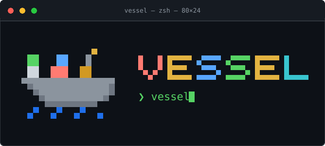

<div align="center">



**vessel** — why run many commands when few keys do the trick?

A keyboard-driven terminal UI for [Apple's native Mac containers](https://github.com/apple/container)
(the OCI-compatible containers introduced in macOS at WWDC 2025). Live lists, logs, shells,
images, and volumes - one screen, zero daemons, no CLI flags to memorize.

[](https://github.com/Laaaaksh/vessel/stargazers)
[](https://github.com/apple/container)

[](https://github.com/Laaaaksh/vessel/actions/workflows/ci.yml)
[](https://github.com/Laaaaksh/vessel/releases)
[](LICENSE)
[](go.mod)
[](#requirements)
[](#install)

**[Install](#install) • [Usage](#usage) • [Keybindings](#keybindings) • [Configuration](#configuration) • [CLI matrix](docs/APPLE_CONTAINER_MATRIX.md) • [Changelog](CHANGELOG.md) • [Contributing](CONTRIBUTING.md) • [License](LICENSE)**

**[Code of conduct](CODE_OF_CONDUCT.md) • [Contributing](CONTRIBUTING.md) • [License](LICENSE) • [Security](SECURITY.md)**

</div>

## What it does

`vessel` gives you a keyboard-driven dashboard for managing Mac containers - the OCI-compatible native containers introduced in macOS at WWDC 2025. No more memorizing CLI flags or running multiple commands to see what's running.

- Live container list with status, CPU %, memory, and sparklines
- Start, stop, restart, remove, and prune
- Drop into a shell inside any running container (clean UI restore on exit)
- Run a one-shot command in a running container and see its output (`e`)
- Stream logs with follow freeze and in-buffer search
- Inspect containers: ports, mounts, networks and IP, CPUs, memory, platform, hostname, env, labels
- Inspect images (digest, layers, command, platform variants) and volumes (quota, format, labels, options)
- Browse / pull / prune images; tag, save, load, and push them; create / prune volumes
- Filter on every list; multi-select; action menu; custom commands
- Vim-style navigation, pane focus, mouse click/wheel

## Requirements

- macOS 26+ on Apple silicon (macOS 15 may work with limitations)
- [Apple Container CLI](https://github.com/apple/container) in your PATH

```bash
brew install container
container system start   # downloads a default Linux kernel on first run
```

## Install

```bash
brew tap Laaaaksh/vessel
brew trust laaaaksh/vessel   # once; Homebrew 6+ refuses untrusted third-party taps
brew install vessel
```

On Homebrew versions before 6.0 there is no trust gate and no `brew trust`
command - skip that step. See [Tap Trust](https://docs.brew.sh/Tap-Trust).

Or download a binary from [GitHub Releases](https://github.com/Laaaaksh/vessel/releases).

## Usage

```bash
vessel
vessel doctor   # check CLI, system status, config
```

### Keybindings

| Key | Action |
|-----|--------|
| `h` / `l` / `←` / `→` | Move focus (sidebar / list / detail) |
| `j` / `↓` | Move down |
| `k` / `↑` | Move up |
| `g` / `G` | Go to top / bottom |
| `pgup` / `pgdown` / `ctrl+u` / `ctrl+d` | Page scroll |
| `enter` | Open shell in container |
| `e` | Run a one-shot command in the selected running container |
| `L` | View logs |
| `f` | Freeze / follow logs |
| `s` / `u` / `r` | Stop / start / restart (stop asks to confirm when `confirm_stop` is set) |
| `d` | Remove the marked row when one is marked, every marked row when 2+, else the selected row (confirm with `y`) |
| `space` | Toggle multi-select mark (containers, images, volumes) |
| `/` | Filter current list |
| `y` | Yank id / name / path |
| `x` | Action menu |
| `p` | Pull image (images view) |
| `P` | Prune (stopped containers / images / volumes), confirm with `y` |
| `c` | New container (form) / new volume (name prompt) |
| `+` / `_` | Cycle layout |
| `` ` `` | Toggle command log |
| `tab` / `1`-`5` | Containers / Images / Volumes / System / Networks |
| `esc` | Close logs, help, modal, or clear filter |
| `?` | Toggle help |
| `q` / `ctrl+c` | Quit |

A custom command with a `key` set fires on that key and replaces the built-in action on it, except on reserved keys (navigation, filtering, and the global keys) - `config.example.toml` documents which keys can be taken over. The in-app help (`?`) always lists what each key currently does.

### Images: tag, save, load, push

Pick an image, press `x`, and choose `Tag…`, `Save…`, `Load…` or `Push`. Tag, save and
push refuse two row shapes: an untagged row, whose bare repository would quietly resolve
to a moving `:latest`, and a digest-pinned row (`repo@sha256:…`) - its reference is
exact, but those verbs are not yet verified against pins. Save prompts for an archive
path and confirms before overwriting a file that already exists; load prompts for an
existing archive and says so plainly when the path is missing; push confirms first,
because it publishes.

Known limits:

- vessel never manages registry credentials. Push reuses whatever session
  `container registry login` has already established - running that login is yours to do.
- Long-running verbs get real budgets: starting or stopping a container gets
  thirty seconds, image pull/tag/save/load/push, prunes and starting a container run
  up to two minutes, one batched delete of many targets gets one minute for the
  whole call, and a one-shot exec gets thirty seconds.
  A run without
  `-d` holds the action status until that budget expires instead of streaming
  output; streaming or detached-launch support for long-running foreground
  sessions is future work.

## Configuration

vessel reads `~/.config/vessel/config.toml` (see `config.example.toml`):

```toml
poll_interval = "2s"
log_tail_lines = 100
mouse_enabled = true
shell = "/bin/sh"

# [[custom_commands]]
# name = "inspect"
# key = "z"          # optional: "z", "space", "enter", "f5", "ctrl+z"
# command = "container inspect {{.ID}}"
```

## Apple CLI matrix

Live probe notes for Apple `container` 1.2.x live in [`docs/APPLE_CONTAINER_MATRIX.md`](docs/APPLE_CONTAINER_MATRIX.md).

## Changelog

Notable changes per release live in [CHANGELOG.md](CHANGELOG.md).

## Contributing

Contributions are welcome. See [CONTRIBUTING.md](CONTRIBUTING.md) - all contributors must sign the CLA before their first PR is merged.

## Security

Found a security issue? Please report it privately - see [SECURITY.md](SECURITY.md).

## Star this repo

If `vessel` makes managing containers on your Mac easier, [leave a star](https://github.com/Laaaaksh/vessel/stargazers) - it helps other people find it.

<a href="https://www.star-history.com/?repos=Laaaaksh%2Fvessel&type=date&legend=top-left">
 <picture>
   <source media="(prefers-color-scheme: dark)" srcset="https://api.star-history.com/chart?repos=Laaaaksh/vessel&type=date&theme=dark&legend=top-left&sealed_token=bSqxGpLu26r_YCDhMfizVeRbrTRt1pSHUKpuWVK76B4W7RIjFJ3H8u7fXpdN4FHdbo17xglDSw7DIhiMkMj5_ZjyB9AzKbl12afWgx-FI94bpnH9lGpLQVne--mPYYYbNmCVnFqaTYd9mFjCHVVIFvllkW4mFw-QTRLPdBKPf7lrk0g36F8rdcvh9L1e" />
   <source media="(prefers-color-scheme: light)" srcset="https://api.star-history.com/chart?repos=Laaaaksh/vessel&type=date&theme=light&legend=top-left&sealed_token=bSqxGpLu26r_YCDhMfizVeRbrTRt1pSHUKpuWVK76B4W7RIjFJ3H8u7fXpdN4FHdbo17xglDSw7DIhiMkMj5_ZjyB9AzKbl12afWgx-FI94bpnH9lGpLQVne--mPYYYbNmCVnFqaTYd9mFjCHVVIFvllkW4mFw-QTRLPdBKPf7lrk0g36F8rdcvh9L1e" />
   
 </picture>
</a>

## License

MIT - see [LICENSE](LICENSE).
